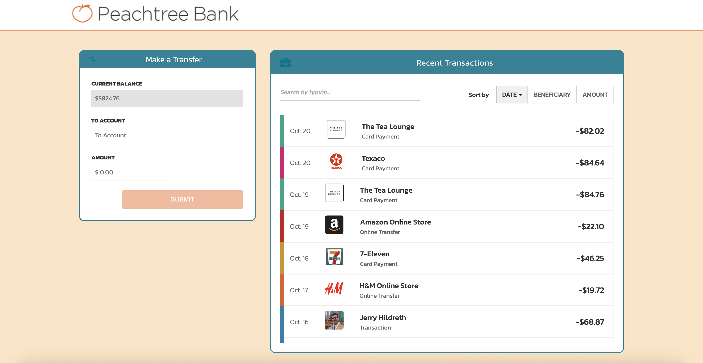

# Peachtree Bank - Transfer & Transaction Dashboard


A modern, responsive banking dashboard built with Angular 21, focusing on high-performance reactivity using Signals and a clean, maintainable architecture.


## 🚀 Key Features

* **Real-time Filtering**: Instantly search through transaction history by merchant, type, or amount.
* **Persistent Sorting**: Sorting direction (Ascending/Descending) is preserved globally when switching between Date, Beneficiary, and Amount columns.
* **Secure Transfer Flow**: Reactive form with strict validation ($0.01 – curent balance limit) and a two-step confirmation preview.
* **Fine-Grained Reactivity**: Leverages **Angular Signals** for state management, ensuring the UI only re-renders exactly what changed.

## 🛠 Tech Stack

* **Framework**: Angular 21 (Standalone Components, Signals API, Modern Control Flow).
* **State Management**: Signal-based `TransactionService` providing a unidirectional data flow.
* **Forms**: Reactive Forms with custom validation and error handling.
* **Styling**: SCSS with CSS Variables.
* **Testing**: Vitest, with specific fixes for Signal Inputs and structural routing tests.

## 📂 Architecture

* **`TransactionService`**: The source of truth for balance and transaction data.
* **`Dashboard`**: The primary page component managing the responsive shell.
* **`TransactionList`**: Smart component managing filtering and sorting interactions.
* **`TransactionItem`**: Presentational component using Signal Inputs.
* **`TransferForm`**: Functional core utilizing Reactive Forms and a confirmation preview state.
  

## 🧪 Getting Started

1.  **Install dependencies**:
    ```bash
    npm install
    ```
2.  **Run the application**:
    ```bash
    ng serve
    ```
3.  **Run unit tests**:
    ```bash
    ng test
    ```
